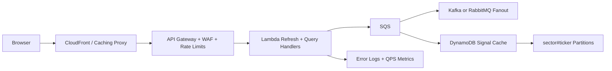

# AlphaRank Production Runbook

## From The Photo To The Repo

Applied directly:
- Docker staging and containerisation: `Dockerfile`, `.dockerignore`, and `nginx.conf`.
- CI/CD and GitHub: `.github/workflows/ci.yml`.
- Cloud deploy path: GitHub Pages, S3 + CloudFront, or container behind a load balancer.
- Caching proxy: immutable cache headers for hashed assets in nginx/CDN.
- Firewall and rate limiting: place WAF/API Gateway in front of future API calls.
- Availability and throughput: Kubernetes starter manifest runs two replicas with health probes.
- WebSockets, long polling, short polling, and RPC: documented in the Ops cockpit as delivery options for future live quote and signal APIs.
- Sharding and partitioning: ticker/sector cache keys and DynamoDB partition strategy are modeled in the Ops cockpit.
- Encryption: HTTPS-only CloudFront policy, HSTS headers, and encrypted storage are part of the cloud checklist.

Designed for the next backend:
- SQS for market-data ingestion jobs.
- Kafka or RabbitMQ for durable fanout if signal events need more than simple queueing.
- Lambda/serverless workers for scheduled quote/news refresh.
- DynamoDB for low-latency signal snapshots.
- Error logging and QPS dashboards for any API layer.

## Local Staging

```bash
docker build -t alpharank .
docker run --rm -p 8080:80 alpharank
```

Open `http://localhost:8080/stock-alpha-/`.

## Static Cloud Deploy

```bash
npm ci
npm run build
aws s3 sync dist/ s3://<bucket>/stock-alpha-/ --delete
```

Put CloudFront in front of the bucket and configure:
- HTTPS only
- `/stock-alpha-/index.html` as fallback for React routes
- long TTL for `/stock-alpha-/assets/*`
- short/no cache for `index.html`

## API Gateway Plan

When live data is added, keep browsers away from providers directly:


