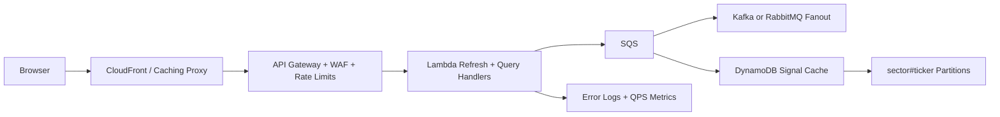

# AlphaRank Production Runbook

## What Exists Today

- CI runs dependency audit, 20 unit tests in a negative-offset timezone, the production build, and a Docker
  build smoke check.
- `Dockerfile`, `.dockerignore`, and `nginx.conf` provide local container
  staging, immutable asset caching, explicit response security headers, SPA
  fallback, and `/healthz`.
- GitHub Pages deployment uses refresh-safe hash routes.
- The React error boundary retains render failures in local storage only. No
  remote telemetry or service-level monitoring is connected.
- `deploy/kubernetes.yml` is a starter template. Replace
  `sha-REPLACE_ME` with a published immutable image tag before applying it.

## Designed For A Future Backend

- S3 + CloudFront hosting, HTTPS-only delivery, WAF, and API rate limiting.
- SQS for market-data ingestion jobs.
- Kafka or RabbitMQ for durable fanout if signal events need more than simple queueing.
- Lambda/serverless workers for scheduled quote/news refresh.
- DynamoDB for low-latency signal snapshots.
- Remote error reporting, QPS dashboards, availability alerts, and rollback automation.

## Local Staging

```bash
docker build -t alpharank .
docker run --rm -p 8080:80 alpharank
```

Open `http://localhost:8080/stock-alpha-/`.

## Static Cloud Deploy

```bash
npm ci
npm run build
aws s3 sync dist/ s3://<bucket>/stock-alpha-/ --delete
```

Put CloudFront in front of the bucket and configure:
- HTTPS only
- `/stock-alpha-/index.html` as the default object (hash routes need no path rewrite)
- long TTL for `/stock-alpha-/assets/*`
- short/no cache for `index.html`

## API Gateway Plan

If live data is added later, keep browsers away from providers directly:


